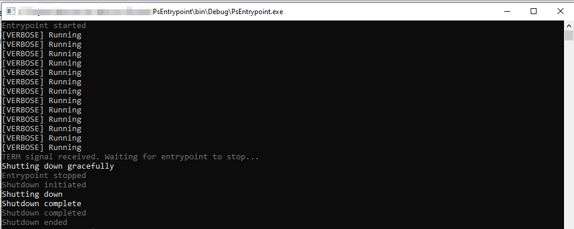

DOCKER ENTRYPOINTS
==================

Docker entrypoints for windows with TERM signal support.


Usage
-----

* Install `psentrypoint.exe` into your .NET Framework container image.
* Add an ENTRYPOINT directive to your `dockerfile`.

### Usage Examples

Run entrypoint script and a shutdown script with custom stop timeout.
```
ENTRYPOINT [ "psentrypoint.exe", "--entrypointScript", "C:\bin\entrypoint\Development.ps1", "--shutdownScript", "C:\bin\entrypoint\Shutdown.ps1", "--stop-timeout", "2000" ]
```

Run an entrypoint script and use a shutdown command.
```
ENTRYPOINT [ "psentrypoint.exe", "--entrypointScript", "C:\bin\entrypoint\Development.ps1", "--shutdownCommand", "Stop-Service mysql" ]
```

### Full Example


**Entrypoint.ps1**
```powershell
# startup

# run code
while(!$container.Shutdown)
{
    Write-Verbose -Verbose -Message "Running"
    Start-Sleep -Seconds 1
}

# shutdown
Write-Host "Shutting down gracefully"
```

**Shutdown.ps1**
```powershell
Write-Host "Shutting down"

Start-Sleep -Seconds 1

Write-Host "Shutdown complete"
```

**Dockerfile**
```dockerfile
ENTRYPOINT [ "psentrypoint.exe", "--entrypointScript", "Entrypoint.ps1", "--shutdownScript", "Shutdown.ps1" ]
```

**Output**



Features
--------

### Interact with psentrypoint.exe from your scripts

Entrypoint commands/scripts can use the special `$container` variable to interact
with psentrypoint.exe.

The `$container` variable is an IContainerState object, provided by psentrypoint.exe, which is loaded into the PSHost so you can access these properties and methods from your scripts.

```c#
interface IContainerState
{
    bool Shutdown { get; }
    void RequestShutdown();
}
```

For example:
```powershell
# start container
& C:\bin\entrypoint\scripts\Register-Runner.ps1
Start-Service gitlab-runner
Start-Sleep -Seconds 2

# run loop
while (!$container.Shutdown)
{
    Start-Sleep -Milliseconds 500

    # check if service is running
    $serviceRunning = (Get-Service gitlab-runner).Status -eq 'Running'
    if (!$serviceRunning)
    {
        # send shutdown request to psentrypoint.exe
        $container.RequestShutdown()
    }
}

# stop container
Stop-Service gitlab-runner
& C:\bin\entrypoint\scripts\Unregister-Runner.ps1
```